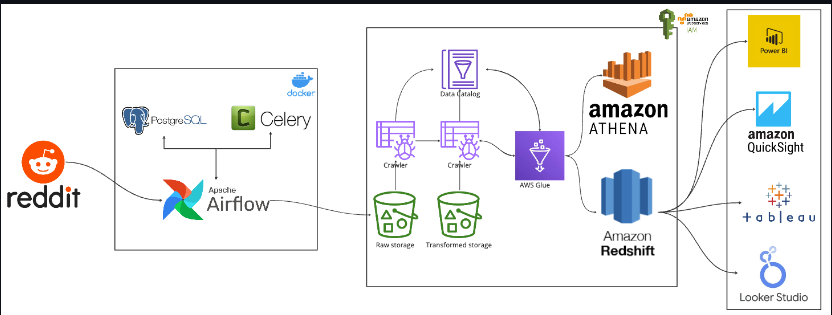

# Reddit-Data-Engineering-Pipeline
In this project, we will use airflow to pull Reddit data and push the data to S3 bucket.
We will connect S3 to AWS glue to perform transformations on data and push the transformed data back to S3.
We will use AWS Crawer to schedule the AWS Glue Data Catalog 
We will use AWS Athena to query the data.

# Techstack Used ::
1. Docker - To create dependencies for python & airflow to run
2. Python==3.9
3. Airflow - to schedule the job
4. AWS S3 - to store the input and output process data
5. AWS Athena - to view the data
6. AWS Glue - To transform the data
7. AWS Crawler - To populate AWS Glue Data Catalog with tables.

# Prerequisites
1. AWS Account with appropriate permissions for S3, Glue, Athena, and Redshift.
2. Reddit API credentials.
3. Docker Installation

# Project Architecture
